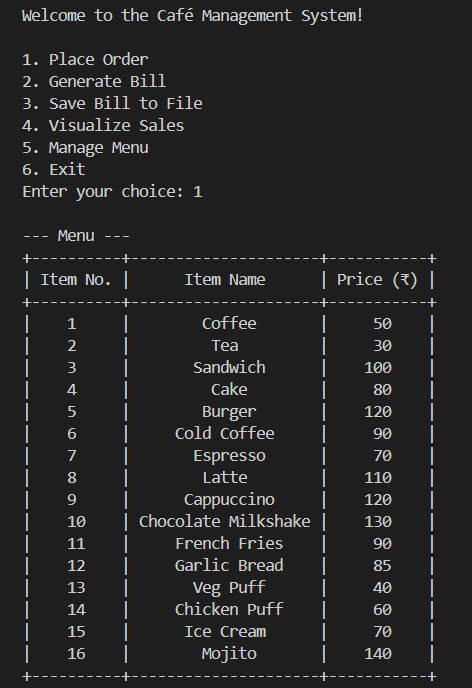
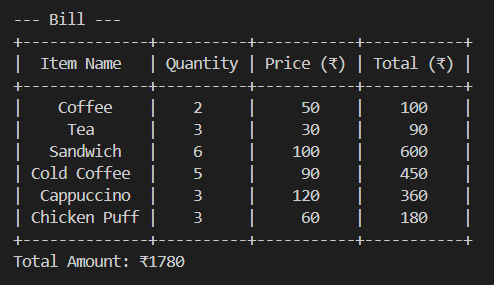
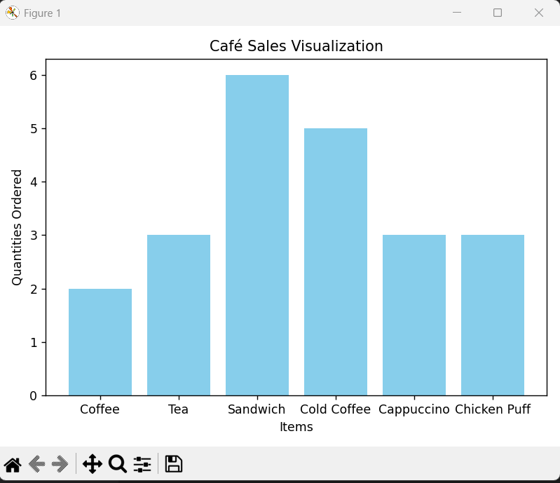

# Café Management System (Python CLI)

A lightweight command-line billing and sales tracking system for cafés.
Place orders, generate itemized bills, save them, and visualize sales directly from the terminal.

## Features
- Interactive order placement
- Input validation
- Automatic billing with totals
- Clean tabular bill output (PrettyTable)
- Save bills to a text file
- Sales visualization using Matplotlib
- Simple object-oriented design

## Tech Stack
- Python 3
- PrettyTable
- Matplotlib

## Installation
Install dependencies:
pip install prettytable matplotlib

## Run the Program
python cafe_management.py

## Menu Options
1. Place Order
2. Generate Bill
3. Save Bill to File
4. Visualize Sales
5. Exit

### Place Order
Enter item number and quantity.
Enter 0 to stop ordering.

### Generate Bill
Displays a formatted bill with totals.

### Save Bill
Creates a file:
cafe_bill.txt

### Visualize Sales
Shows a bar chart of ordered items.

### Exit
Closes the program.

## Screenshots

## Limitations
- No persistent storage
- Static menu
- Orders reset each run
- CLI interface only
- Single-user session

## Planned Enhancements
- GST / discounts
- Edit or remove items from orders
- Customer details
- CSV / Database storage
- GUI or Web interface

## License
MIT License
Free to use and modify.
